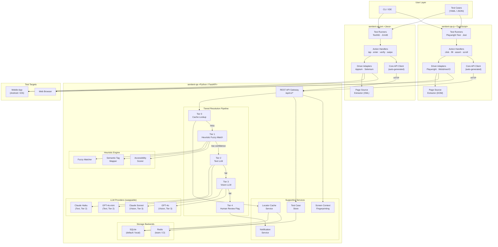
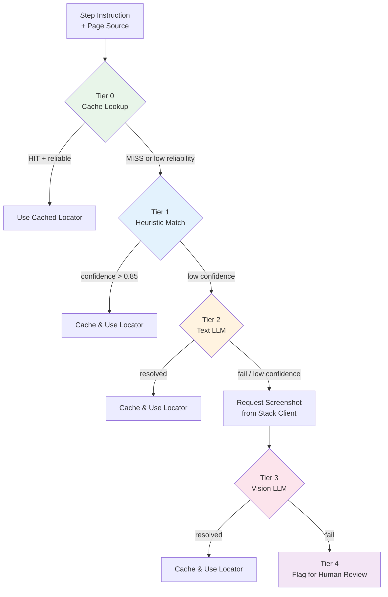
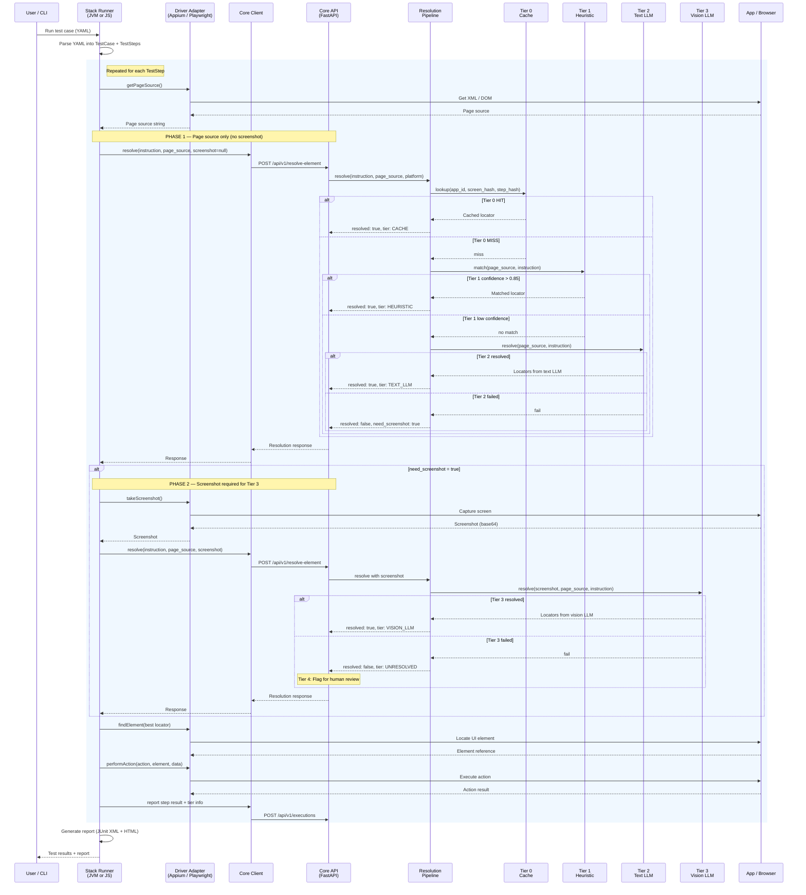

# AI-Driven No-Code Test Automation Framework — Architecture Document

| Field        | Value                          |
|--------------|--------------------------------|
| **Version**  | 2.0                            |
| **Date**     | 2026-04-07                     |
| **Status**   | Draft                          |
| **Author**   | Shahid                         |

---

## Table of Contents

1. [System Overview & Goals](#1-system-overview--goals)
2. [High-Level Architecture](#2-high-level-architecture)
3. [Tiered Resolution Pipeline](#3-tiered-resolution-pipeline)
4. [Core Service Internals](#4-core-service-internals-sentient-qa)
5. [Stack Client Architecture](#5-stack-client-architecture)
6. [Execution Flow & Two-Phase Protocol](#6-execution-flow--two-phase-protocol)
7. [Plugin Architecture & Extension Points](#7-plugin-architecture--extension-points)
8. [Cache Strategy Overview](#8-cache-strategy-overview)
9. [Deployment Topology](#9-deployment-topology)
10. [Inter-Repo Dependency Management](#10-inter-repo-dependency-management)
11. [API Contract Summary](#11-api-contract-summary)
12. [Cost & Performance Projections](#12-cost--performance-projections)
13. [Future Considerations](#13-future-considerations)

---

## 1. System Overview & Goals

### Problem Statement

Traditional test automation demands deep programming expertise and relies on brittle CSS selectors, XPaths, and resource IDs that break with every UI change. Teams spend more time maintaining locators than writing meaningful tests. Pure AI-vision approaches solve the brittleness problem but are too slow (~3-5s per step) and too expensive (~$0.02 per call) to run at scale.

### Solution

A **no-code test automation framework** where testers write plain-English or structured YAML/JSON test steps. The framework resolves UI elements through a **Tiered Resolution Pipeline** — cascading from free/instant cache lookups through zero-cost heuristic matching, cheap text-only LLM resolution, and finally expensive vision-based LLM resolution — using the cheapest method that works. This makes the framework viable at scale (20K+ tests/day) without prohibitive AI costs.

**Example test case:**

```yaml
test: Login with valid credentials
platform: android
steps:
  - launch app: com.example.app
  - tap: "Allow" button on permission dialog
  - enter: "user@test.com" in "Email" field
  - enter: "Pass1234" in "Password" field
  - tap: "Sign In" button
  - verify: "Welcome" text is displayed
```

### Design Goals

- **Zero-code test authoring** — testers write natural-language instructions; no locators, no page objects, no code
- **Tiered resolution for cost efficiency** — cache → heuristic → text LLM → vision LLM; use the cheapest tier that works
- **Two-phase resolution protocol** — always try page-source-only first; request screenshot only when needed (saves bandwidth and latency)
- **Multi-platform** — supports mobile (Android/iOS) and web, extensible to desktop
- **Multi-language** — JVM (Java), JS/TS, and Python (future) stack clients, all driven from a single OpenAPI contract
- **Plugin-based extensibility** — swappable drivers, AI providers, heuristic matchers, cache backends, test runners, action handlers, and notification channels
- **Local-first with CI/CD readiness** — runs as a Docker sidecar locally, scales to shared service in pipelines
- **Configurable tier ordering** — teams can enable/disable/reorder tiers per project via YAML config

### Out of Scope (v1)

- Visual regression testing (designed-for, not implemented)
- Self-healing locators (automatic locator repair without re-resolution)
- Complex natural-language assertions beyond simple verify/assert
- Desktop application testing
- Test generation from user stories

---

## 2. High-Level Architecture

The framework follows a **hybrid multi-repo architecture** with a "Core as a Service" philosophy. All heavy, language-agnostic logic (tiered resolution pipeline, caching, heuristic matching, prompt management, test case persistence) lives in a central **Core Service**. Each language/platform stack lives in its own repo as a **thin client** that calls the Core Service and handles only driver interaction, page source extraction, action execution, and reporting.

### Repository Responsibilities

| Repository | Language | Responsibility | Key Technologies |
|---|---|---|---|
| **sentient-qa** | Python | Tiered resolution pipeline, locator caching, heuristic matching, LLM integration, test case persistence, screen context, notifications | FastAPI, SQLite, Jinja2, Claude API, fuzzy matching |
| **sentient-qa-jvm** | Java | Mobile/web driver execution, page source extraction, test running, reporting | Appium, Selenium, TestNG, JUnit5 |
| **sentient-qa-js** | TypeScript | Web driver execution, DOM extraction, test running, reporting | Playwright, WebdriverIO, Jest |
| **sentient-qa-python** *(future)* | Python | Driver execution, test running | Selenium, Appium-Python, pytest |

### Architectural Rules

1. The Core Service is the **single source of truth** for the resolution pipeline, caching, and test case storage. No stack repo reimplements this logic.
2. Stack repos contain a **thin auto-generated HTTP client** from the OpenAPI spec — zero hand-written duplication.
3. Each stack repo versions and releases independently. The only coupling is the Core API version.
4. Core Service runs as a Docker container locally or as a shared team service in CI/CD.
5. API contracts (OpenAPI) are published as versioned artifacts so client generation is reproducible.

### System Component Diagram



---

## 3. Tiered Resolution Pipeline

The **Tiered Resolution Pipeline** is the core innovation of this framework. Instead of relying on expensive vision-based AI for every element lookup, it cascades through increasingly powerful (and expensive) resolution methods.

### Tier Overview

| Tier | Method | Latency | Cost/Call | Expected Volume | Requires |
|---|---|---|---|---|---|
| **Tier 0** | Cache Lookup | ~0ms | $0 | 70-85% of steps | Cache key (app_id + screen_hash + step_hash) |
| **Tier 1** | Heuristic Fuzzy Match | ~50ms | $0 | ~10% of steps | Page source (XML/DOM) |
| **Tier 2** | Page Source + Text LLM | ~200-500ms | ~$0.001 | ~12% of steps | Page source (XML/DOM) |
| **Tier 3** | Screenshot + Vision LLM | ~3-5s | ~$0.02 | ~2.5% of steps | Screenshot (base64) + page source |
| **Tier 4** | Human Review Flag | — | $0 | ~0.5% of steps | All prior tier artifacts |

### Tier 0: Cache Lookup

- Lookup by composite key: `app_id + screen_context_hash + step_hash`
- If HIT and `success_count / total_count > reliability_threshold` → use cached locator
- If HIT but reliability is declining → promote to Tier 1 for re-resolution
- Resolution result from **any tier** is cached back here for future use

### Tier 1: Heuristic Fuzzy Match (No AI)

A zero-cost, algorithmic matching engine that parses page source and finds elements without any LLM calls.

- **Exact text match** on element labels, text content, `content-desc`, `aria-label`
- **Fuzzy match** (Levenshtein / Jaro-Winkler distance) on accessible names, placeholder text, hints
- **Semantic tag mapping**: instruction verb → element type filter (e.g., "button" → `<Button>`, `<input type="submit">`, `role="button"`)
- **Accessibility scoring**: prioritizes elements with strong accessibility attributes
- **Confidence threshold**: only accept if score > 0.85

**Example**: instruction `"tap Login"` → finds `<Button text="Login" resource-id="btn_login">` → match with confidence 0.95

### Tier 2: Page Source + Text LLM

Sends page source (XML/DOM) + instruction to a lightweight **text-only** LLM (Claude Haiku / GPT-4o-mini). No screenshot required — text tokens are 10-20x cheaper than vision tokens.

- The LLM reads the element hierarchy, attributes, and labels, then returns ranked locator strategies
- Works for most standard UI: buttons, fields, labels, lists, nav items — anything with text/accessibility attributes in the DOM
- Uses Jinja2 prompt template: `page-source-locate.j2`

### Tier 3: Screenshot + Vision LLM

Takes a screenshot via the driver and sends it with the instruction to a vision-capable LLM (Claude Sonnet / GPT-4o). Also includes page source for cross-referencing.

- Reserved for: icon-only buttons, custom-rendered UI, canvas/game elements, elements with no accessible labels, visually complex layouts
- Uses Jinja2 prompt template: `vision-locate.j2`
- Cross-references visual identification with page source to find the most durable locator

### Tier 4: Human Review Flag

When all automated tiers fail, the step is flagged for human review.

- Logs: screenshot, page source, instruction, and all tier attempt results
- Creates an actionable review item in the review queue
- Optional notification via Slack/email/webhook (`INotifier` interface)
- Does NOT fail silently

### Tier Cascade Flow



### Configurable Tier Ordering

Tiers can be enabled, disabled, or reordered per project via YAML configuration:

```yaml
# Example: cost-sensitive project — skip vision tier
resolution:
  tiers:
    - tier0_cache
    - tier1_heuristic
    - tier2_text_llm
    # tier3_vision_llm: disabled
    - tier4_flag

# Example: app with poor accessibility labels — skip heuristic
resolution:
  tiers:
    - tier0_cache
    # tier1_heuristic: disabled (poor accessibility)
    - tier2_text_llm
    - tier3_vision_llm
    - tier4_flag
```

---

## 4. Core Service Internals (sentient-qa)

The Core Service is a **Python FastAPI** application structured around the tiered resolution pipeline with supporting services.

### 4.1 Resolution Pipeline Orchestrator

Central coordinator that drives the tier cascade for each `resolve-element` request.

- **Module**: `services/resolver/pipeline.py`
- Reads tier configuration from YAML config
- Executes tiers in order, stopping at the first successful resolution
- Implements the **two-phase protocol**: first call receives page source only; if Tiers 0-2 fail, responds with `need_screenshot: true`; second call includes the screenshot for Tier 3

### 4.2 Tier Implementations

| Tier | Module | Dependencies |
|---|---|---|
| Tier 0: Cache | `services/resolver/tier0_cache.py` | Locator Cache Service |
| Tier 1: Heuristic | `services/resolver/tier1_heuristic.py` | Heuristic Engine |
| Tier 2: Text LLM | `services/resolver/tier2_text_llm.py` | LLM Providers (text) + Prompt Templates |
| Tier 3: Vision LLM | `services/resolver/tier3_vision_llm.py` | LLM Providers (vision) + Prompt Templates |
| Tier 4: Flag | `services/resolver/tier4_flag.py` | Notification Service |

### 4.3 Heuristic Engine (Tier 1)

A zero-cost matching engine with pluggable matchers (`IHeuristicMatcher` interface).

- **`fuzzy_matcher.py`** — Levenshtein/Jaro-Winkler distance on element text, labels, and accessible names
- **`semantic_tag_mapper.py`** — maps instruction verbs to element types (e.g., "button" → `<Button>`, `role="button"`)
- **`accessibility_scorer.py`** — scores elements by accessibility attribute quality; prioritizes `accessibility-id` and `content-desc`

### 4.4 LLM Providers

Providers are split into **text** and **vision** variants, each implementing `IElementResolver`.

| Provider | Type | Tier | Model |
|---|---|---|---|
| `claude_text.py` | Text | Tier 2 | Claude Haiku |
| `claude_vision.py` | Vision | Tier 3 | Claude Sonnet |
| `openai_text.py` | Text | Tier 2 | GPT-4o-mini |
| `openai_vision.py` | Vision | Tier 3 | GPT-4o |
| `gemini.py` | Both | Tier 2/3 | Gemini |

### 4.5 Prompt Templates

Jinja2 templates stored in `services/prompt-templates/`:

| Template | Tier | Input | Purpose |
|---|---|---|---|
| `page-source-locate.j2` | Tier 2 | Page source + instruction | Text-only element location |
| `vision-locate.j2` | Tier 3 | Screenshot + page source + instruction | Visual element location |
| `assertion-verify.j2` | Tier 2/3 | Page source/screenshot + assertion | Verification of assertions |

### 4.6 Locator Cache Service

- **Interface**: `ILocatorCache` with `lookup()`, `store()`, `invalidate()`, `flush()`, and `stats()` methods
- **Backends**: SQLite (default), Redis (team/CI). Configurable via environment variable.
- **Cache Promotion**: Tier 3 (vision) resolved entries that keep succeeding are optionally re-resolved at Tier 1 to find cheaper, more durable locators

### 4.7 Test Case Store Service

- **Input Formats**: YAML and JSON test case definitions
- **Validation**: Schema validation on ingest; rejects malformed steps
- **Persistence**: Stored as structured JSON in SQLite with full CRUD + run trigger
- **Features**: Tagging, filtering by platform/name/tag, suite grouping

### 4.8 Screen Context Service

Provides screen fingerprinting for cache key accuracy.

- **Mobile**: hash of activity name + top-level layout structure + visible text elements from page source
- **Web**: hash of URL path + page title + top-level DOM structure
- **Purpose**: Two screens with same elements but different layouts produce different cache keys

### 4.9 Notification Service

Handles Tier 4 alerts when steps cannot be resolved.

- **Interface**: `INotifier` — pluggable notification channels
- **Channels**: Slack, email, webhook (configurable)
- **Content**: Screenshot, page source, instruction, and all tier attempt results

### 4.10 API Layer

- **Framework**: FastAPI with automatic OpenAPI 3.0 spec generation
- **Request/Response Models**: Pydantic v2 models with strict validation
- **Versioning**: URL-based (`/api/v1/`), with deprecation headers on sunset routes
- **Authentication**: API key header (optional, configurable for shared deployments)

### 4.11 Directory Structure

```
sentient-qa/
├── api/
│   ├── openapi.yaml                 # API contract (source of truth)
│   └── proto/                       # Optional gRPC definitions
├── services/
│   ├── resolver/
│   │   ├── pipeline.py              # Orchestrates tier cascade
│   │   ├── tier0_cache.py           # Cache lookup
│   │   ├── tier1_heuristic.py       # Fuzzy match on page source (no AI)
│   │   ├── tier2_text_llm.py        # Page source + text LLM
│   │   ├── tier3_vision_llm.py      # Screenshot + vision LLM
│   │   └── tier4_flag.py            # Human review flagging
│   ├── providers/                   # LLM provider plugins
│   │   ├── base.py                  # IElementResolver interface
│   │   ├── claude_text.py           # Claude Haiku (Tier 2)
│   │   ├── claude_vision.py         # Claude Sonnet (Tier 3)
│   │   ├── openai_text.py           # GPT-4o-mini (Tier 2)
│   │   ├── openai_vision.py         # GPT-4o (Tier 3)
│   │   └── gemini.py
│   ├── prompt-templates/
│   │   ├── page-source-locate.j2    # Tier 2: text-only prompt
│   │   ├── vision-locate.j2         # Tier 3: vision prompt
│   │   └── assertion-verify.j2
│   ├── locator-cache/               # Cache CRUD + invalidation logic
│   │   ├── base.py                  # ILocatorCache interface
│   │   ├── sqlite_cache.py
│   │   └── redis_cache.py
│   ├── heuristic/                   # Tier 1 matching engine
│   │   ├── fuzzy_matcher.py
│   │   ├── semantic_tag_mapper.py
│   │   └── accessibility_scorer.py
│   ├── test-case-store/             # YAML/JSON parse, persist, retrieve
│   ├── screen-context/              # Screen fingerprinting / similarity
│   └── notification/                # Tier 4 alerts (Slack, email, webhook)
├── models/
│   ├── test_case.py
│   ├── locator_entry.py
│   ├── execution_result.py
│   ├── resolution_result.py
│   └── screen_context.py
├── db/
│   ├── migrations/
│   └── sqlite/
├── Dockerfile
├── docker-compose.yml
└── README.md
```

---

## 5. Stack Client Architecture

Every stack repo follows an identical layered pattern. The only differences are language, driver implementations, and test runner integrations. In v2, each stack repo also includes a **page source extractor** that provides DOM/XML to the Core Service.

### Shared Layer Pattern

```
Stack Repo
├── core-client/        # Auto-generated HTTP client from OpenAPI spec
├── drivers/            # IDriverAdapter implementations
├── actions/            # IActionHandler implementations
├── runners/            # ITestRunner implementations
├── page-source/        # Page source parser + extractor
└── config/             # Framework configuration
```

### 5.1 sentient-qa-jvm (Java)

| Aspect | Detail |
|---|---|
| **Build** | Maven |
| **Client Generation** | `openapi-generator-maven-plugin` → typed HTTP client in `core-client/` |
| **Drivers** | Appium (mobile), Selenium (web) — each implements `IDriverAdapter` |
| **Page Source** | XML parser using `driver.getPageSource()` for mobile; DOM parser for web |
| **Runners** | TestNG and JUnit5 integrations |
| **Reports** | JUnit XML + HTML report generation |
| **Actions** | `tap`, `enter`, `swipe`, `verify`, `wait`, `scroll`, `long_press` |

### 5.2 sentient-qa-js (TypeScript)

| Aspect | Detail |
|---|---|
| **Build** | npm / pnpm with TypeScript compilation |
| **Client Generation** | `openapi-typescript` or `openapi-fetch` → typed fetch client in `core-client/` |
| **Drivers** | Playwright (primary), WebdriverIO (future) — each implements `IDriverAdapter` |
| **Page Source** | DOM parser using `page.content()` for HTML |
| **Runners** | Playwright Test and Jest integrations |
| **Reports** | JUnit XML + HTML report generation |
| **Actions** | `click`, `fill`, `assert`, `scroll`, `hover`, `select` |

### 5.3 sentient-qa-python (Future)

| Aspect | Detail |
|---|---|
| **Build** | pip / Poetry |
| **Client Generation** | `openapi-python-client` → typed client in `core_client/` |
| **Drivers** | Selenium, Appium-Python |
| **Runners** | pytest integration |

### Key Architectural Rule

> Stack repos contain **zero resolution logic**. They are orchestrators that coordinate between driver actions and Core Service API calls. All intelligence (heuristics, LLM calls, caching) lives in the Core Service.

---

## 6. Execution Flow & Two-Phase Protocol

### Two-Phase Resolution Protocol

The framework uses a **two-phase protocol** to minimize bandwidth and latency:

- **Phase 1**: Stack client sends `instruction + page_source` (no screenshot). Core tries Tier 0 (cache) → Tier 1 (heuristic) → Tier 2 (text LLM).
- **Phase 2** (only if Phase 1 fails): Core responds with `need_screenshot: true`. Stack client captures a screenshot and resends the request with the screenshot included. Core runs Tier 3 (vision LLM).

This avoids sending expensive base64 screenshots for the ~95% of steps that resolve without vision.

### Execution Narrative

1. **User triggers test run** via CLI command or test runner.
2. **Stack runner parses** the YAML/JSON test case into a `TestCase` object with ordered `TestStep` entries.
3. **For each test step**, the runner orchestrates:
   - a. **Page source capture**: Driver calls `getPageSource()` to get the current XML (mobile) or DOM (web).
   - b. **Phase 1 — resolve without screenshot**: Stack client calls `POST /api/v1/resolve-element` with `instruction`, `platform`, `app_context`, and `page_source` (screenshot = null).
   - c. **Core runs Tiers 0-2**: Cache lookup → heuristic match → text LLM.
   - d. **If resolved** (`resolved: true`): Core returns locators. Stack client uses the best locator via driver's `findElement()`.
   - e. **If not resolved** (`need_screenshot: true`): Stack client captures a screenshot via `takeScreenshot()`, then calls `POST /api/v1/resolve-element` again with the screenshot included.
   - f. **Core runs Tier 3** (vision LLM): Returns locators or flags for human review (Tier 4).
   - g. **Action execution**: Runner calls the appropriate `IActionHandler` which uses the driver to perform the action on the located element.
   - h. **Result reporting**: Runner sends step-level results (including resolution tier) to `POST /api/v1/executions`.
4. **After all steps**: Runner generates a report (JUnit XML + HTML) and presents results to the user.

### Execution Flow Sequence Diagram



---

## 7. Plugin Architecture & Extension Points

The framework is extensible at every layer through well-defined plugin interfaces.

### Plugin Interface Summary

| Interface | Repository | Language | Key Methods |
|---|---|---|---|
| `IElementResolver` | sentient-qa | Python | `resolve(input, instruction, platform) → ResolutionResult` (text and vision variants) |
| `ILocatorCache` | sentient-qa | Python | `lookup(key)`, `store(key, entry)`, `invalidate(key, reason)`, `flush(scope)`, `stats()` |
| `IHeuristicMatcher` | sentient-qa | Python | `match(page_source, instruction, platform) → MatchResult` |
| `INotifier` | sentient-qa | Python | `notify(event_type, payload)` — Slack, email, webhook |
| `IDriverAdapter` | Stack repos | Java / TS / Py | `takeScreenshot()`, `getPageSource()`, `findElement(strategy, value)`, `performAction(action, element, data)` |
| `IActionHandler` | Stack repos | Java / TS / Py | `execute(action, target, data, driver)`, `supports(actionName) → bool` |
| `ITestRunner` | Stack repos | Java / TS / Py | `run(testCase)`, `onStepStart(step)`, `onStepEnd(step, result)`, `generateReport()` |

### Registration & Discovery

All plugins are **configuration-driven** via YAML config files:

```yaml
# sentient-qa config
resolution:
  tiers:
    - tier0_cache
    - tier1_heuristic
    - tier2_text_llm
    - tier3_vision_llm
    - tier4_flag
  providers:
    text: claude-haiku              # IElementResolver (text)
    vision: claude-sonnet           # IElementResolver (vision)
  heuristic:
    matchers:
      - fuzzy_matcher
      - semantic_tag_mapper
      - accessibility_scorer
    confidence_threshold: 0.85
cache:
  backend: sqlite                   # ILocatorCache implementation
notification:
  channels:
    - slack                         # INotifier implementation
```

```yaml
# sentient-qa-jvm config
driver: appium                      # IDriverAdapter implementation
runner: testng                      # ITestRunner implementation
actions:
  - tap
  - enter
  - verify
  - swipe
  - wait
  - long_press
```

### Extension Examples

- **Add a new AI provider**: Implement `IElementResolver` in `services/providers/`, register in config
- **Add a new heuristic matcher** (e.g., image-alt-text matcher): Implement `IHeuristicMatcher` in `services/heuristic/`, register in config
- **Add a new action** (e.g., `long_press`): Implement `IActionHandler` in the stack repo's `actions/` directory
- **Add a new driver** (e.g., WebdriverIO): Implement `IDriverAdapter` in the stack repo's `drivers/`
- **Switch cache backend**: Implement `ILocatorCache`, update config
- **Add a notification channel**: Implement `INotifier` in `services/notification/`
- **Configure tier ordering**: Edit the `resolution.tiers` list in YAML config

---

## 8. Cache Strategy Overview

The caching layer (Tier 0) is central to the framework's performance and cost efficiency. Results from **any** resolution tier are cached for future use.

### Cache Key Design

```
cache_key = hash(app_id + screen_context_hash + step_instruction_normalized)
```

| Component | Source | Example |
|---|---|---|
| `app_id` | Package name (mobile) or base URL (web) | `com.example.app` |
| `screen_context_hash` | Fingerprint of current screen from page source | `sha256:a3f8b2...` |
| `step_instruction_normalized` | Lowercased, stemmed, stopwords-removed instruction | `tap sign in button` |

### Cache Entry Schema

| Field | Type | Description |
|---|---|---|
| `cache_key` | String | Composite hash key |
| `app_id` | String | Application identifier |
| `app_version` | String | App version at resolution time |
| `screen_context_hash` | String | Screen fingerprint |
| `step_hash` | String | Hash of normalized instruction |
| `step_instruction` | String | Original instruction text |
| `locators` | Array | Ranked list: `[{ strategy, value, rank }]` |
| `resolution_tier` | Enum | `CACHE`, `HEURISTIC`, `TEXT_LLM`, `VISION_LLM` |
| `confidence` | Float (0-1) | Resolution confidence score |
| `bbox` | JSON | `{x, y, width, height}` — bounding box (if available) |
| `created_at` | DateTime | When the entry was created |
| `last_used_at` | DateTime | Last successful use |
| `success_count` | Integer | Total successful finds |
| `failure_count` | Integer | Consecutive failed finds |
| `ttl_days` | Integer | Time-to-live (default: 30) |

### Invalidation Policies

| Policy | Trigger | Action |
|---|---|---|
| **Failure Threshold** | 3 consecutive `findElement` failures | Invalidate; re-resolve from Tier 1 |
| **TTL Expiry** | Entry unused for > `ttl_days` (default 30) | Mark stale; re-resolve on next access |
| **App Version Change** | `app_version` differs from cached entry | Mark `STALE`; try first but re-resolve on 1 failure (lower threshold) |
| **Manual Flush** | CLI command or `POST /api/v1/cache/flush` | Flush by app, screen, or globally |
| **Confidence Decay** | Periodic check on Tier 3 entries | Re-resolve at Tier 1 to find cheaper, more durable locator |

### Cache Promotion

A background process periodically attempts to "promote" expensive Tier 3 (vision) resolved entries by re-resolving them at Tier 1 (heuristic). If a cheaper locator is found with high confidence, it replaces the vision-resolved entry — reducing future costs and improving speed.

### Team Sharing

| Environment | Backend | Use Case |
|---|---|---|
| Local dev | SQLite | Single developer, volume-mounted for persistence |
| CI/CD / Team | Redis | Shared cache across team members and pipeline runs |

---

## 9. Deployment Topology

### Local Development

The Core Service runs as a **Docker sidecar** alongside the stack repo on the developer's machine.

```
Developer Machine
├── IDE / Terminal
│   └── Stack Repo (runs on host)
│       └── Calls http://localhost:8000/api/v1/*
├── Docker
│   └── sentient-qa container (:8000)
│       ├── FastAPI application
│       ├── SQLite (volume-mounted for persistence)
│       └── Outbound: LLM Provider APIs (cloud)
└── Appium Server / Browser (test target)
```

**Docker Compose** starts the Core Service with a single command:

```bash
cd sentient-qa && docker-compose up -d
```

### CI/CD Pipeline

In CI/CD, the Core Service runs as a shared container with Redis for team-wide cache sharing. Cache can be pre-warmed from the last successful run.

```
CI Pipeline
├── Stage 1: Build & Publish
│   └── sentient-qa → Build Docker image, publish OpenAPI spec artifact
├── Stage 2: Client Generation
│   └── Stack repos pull OpenAPI spec, auto-generate clients, build
├── Stage 3: Cache Warm-Up (optional)
│   └── Restore cache from previous successful run (Redis snapshot or SQLite dump)
├── Stage 4: Test Execution
│   ├── Core container (shared, with Redis backend)
│   ├── Stack container (runs tests)
│   └── Test targets (emulators, browsers)
└── Stage 5: Report & Artifacts
    └── JUnit XML + HTML reports published, cache snapshot saved
```

---

## 10. Inter-Repo Dependency Management

### Single Source of Truth

The file `sentient-qa/api/openapi.yaml` is the **canonical API contract**. It is:
- Auto-generated from FastAPI's Pydantic models
- Manually reviewed and versioned in source control
- Published as a versioned artifact on every Core Service release

### API Versioning

- **Strategy**: URL-based versioning (`/api/v1/`, `/api/v2/`)
- **Deprecation**: Sunset headers on deprecated endpoints; minimum 2-release deprecation window
- **Backward Compatibility**: Maintained within a major API version. Breaking changes require a version bump.
- **Semantic Versioning**: Core API follows semver — patch for bug fixes, minor for additive changes, major for breaking changes

### Client Generation Per Stack

| Stack | Generator Tool | Command |
|---|---|---|
| JVM (Java) | `openapi-generator` (Java generator) | `make generate-client` |
| JS/TS | `openapi-typescript` / `openapi-fetch` | `npm run generate-client` |
| Python | `openapi-python-client` | `make generate-client` |

Each stack repo has an automated script that:
1. Pulls the latest versioned OpenAPI spec artifact
2. Regenerates the typed HTTP client in `core-client/`
3. Runs compilation/type-check to verify compatibility

### Dependency Flow

```
sentient-qa (publishes openapi.yaml v1.x)
    │
    ├── sentient-qa-jvm   (consumes spec → generates Java client)
    ├── sentient-qa-js    (consumes spec → generates TS client)
    └── sentient-qa-python (consumes spec → generates Python client)
```

---

## 11. API Contract Summary

### Element Resolution (Two-Phase)

| Method | Endpoint | Purpose |
|---|---|---|
| `POST` | `/api/v1/resolve-element` | Phase 1: send page source + instruction (screenshot=null). Phase 2: resend with screenshot if `need_screenshot=true` |

### Cache Management

| Method | Endpoint | Purpose |
|---|---|---|
| `GET` | `/api/v1/cache/lookup` | Look up cached locator by composite key |
| `POST` | `/api/v1/cache/store` | Store a resolved locator in cache |
| `POST` | `/api/v1/cache/invalidate` | Invalidate a cache entry with reason |
| `POST` | `/api/v1/cache/flush` | Flush cache by scope (app, screen, or global) |
| `GET` | `/api/v1/cache/stats` | Get cache statistics (hit rate, tier distribution, stale count) |

### Test Case Management

| Method | Endpoint | Purpose |
|---|---|---|
| `POST` | `/api/v1/test-cases` | Create / save a test case |
| `GET` | `/api/v1/test-cases` | List test cases with filters |
| `GET` | `/api/v1/test-cases/{id}` | Retrieve a specific test case |
| `PUT` | `/api/v1/test-cases/{id}` | Update a test case |
| `DELETE` | `/api/v1/test-cases/{id}` | Delete a test case |
| `POST` | `/api/v1/test-cases/{id}/run` | Trigger execution of a test case |

### Execution Results

| Method | Endpoint | Purpose |
|---|---|---|
| `POST` | `/api/v1/executions` | Record an execution result with step-level details + tier info |
| `GET` | `/api/v1/executions` | List/filter execution results |
| `GET` | `/api/v1/executions/{id}` | Get detailed execution with step-level results |

### Human Review Queue (Tier 4)

| Method | Endpoint | Purpose |
|---|---|---|
| `GET` | `/api/v1/review-queue` | List steps flagged for human review |
| `POST` | `/api/v1/review-queue/{id}/resolve` | Manually provide a locator for a flagged step |

> The full OpenAPI 3.0 specification will be maintained at `sentient-qa/api/openapi.yaml` and serves as the definitive contract between Core and all stack clients.

---

## 12. Cost & Performance Projections

### Current Test Landscape

| Category | Tests/Day | In Scope for This Framework |
|---|---|---|
| Backend / API tests | ~47,000 | No (no UI involved) |
| App + UI tests (mobile & web) | ~3,000 | Yes |
| **Total** | **~50,000** | **~3,000** |

> This framework targets **App + UI tests only**. The ~47K backend tests run through existing API testing pipelines and are out of scope. All cost projections below are based on the 3K UI tests that this framework will serve.

### Cost at Current Scale (3K UI tests/day, ~8 steps each = 24K steps/day)

| Tier | % of Steps | Volume/Day | Cost/Call | Daily Cost | Latency |
|---|---|---|---|---|---|
| Tier 0: Cache | 75% | 18,000 | $0 | $0 | ~0ms |
| Tier 1: Heuristic | 10% | 2,400 | $0 | $0 | ~50ms |
| Tier 2: Text LLM | 12% | 2,880 | ~$0.001 | ~$3 | ~300ms |
| Tier 3: Vision LLM | 2.5% | 600 | ~$0.02 | ~$12 | ~4s |
| Tier 4: Human Flag | 0.5% | 120 | $0 | $0 | — |
| **Total** | | **24,000** | | **~$15/day** | |

### Cost Projections at Growth Scales

| Scale (UI tests/day) | Steps/Day | Daily AI Cost | Monthly AI Cost | vs. Pure Vision |
|---|---|---|---|---|
| **3K (current)** | 24,000 | ~$15 | ~$450 | Pure vision: ~$480/day |
| 5K | 40,000 | ~$25 | ~$750 | Pure vision: ~$800/day |
| 10K | 80,000 | ~$49 | ~$1,470 | Pure vision: ~$1,600/day |
| 20K | 160,000 | ~$99 | ~$2,970 | Pure vision: ~$3,200/day |

### Comparison with Alternative Approaches (at current 24K steps/day)

| Approach | Daily Cost | Avg Latency | Notes |
|---|---|---|---|
| **This framework (tiered)** | ~$15 | ~100ms weighted avg | 85% of steps resolved at zero cost |
| Pure vision (every step) | ~$480 first run; ~$96 after cache | ~4s uncached | 32x more expensive |
| Traditional page objects | $0 (no AI) | ~10ms | High maintenance cost; brittle locators |
| Self-healing frameworks | Varies | ~500ms | Requires initial locator setup |

### Performance Notes

- At 3K UI tests/day, the framework costs roughly **$15/day (~$450/month)** — well within budget for eliminating locator maintenance
- Cache warm-up is critical: first run of a new test suite will be slower and more expensive
- Tier 1 heuristic matching improves with apps that have good accessibility labeling
- Tier configuration can be tuned per project for cost/speed trade-offs
- As backend API tests are out of scope, future expansion could include an API testing module, but the current architecture focuses exclusively on UI element resolution

---

## 13. Future Considerations

The architecture is designed to accommodate the following enhancements in future versions:

| Feature | How the Architecture Supports It |
|---|---|
| **Visual Regression Testing** | Screen Context Service already captures screen fingerprints; extend with pixel-diff comparison |
| **Self-Healing Locators** | Cache tracks success/failure counts + resolution tier; add automatic re-resolution with tier escalation |
| **Natural-Language Assertions** | Resolution pipeline already handles instructions; add assertion-specific prompt templates |
| **Test Generation from User Stories** | Add a new service that converts user stories to YAML test cases using LLM |
| **Desktop App Testing** | Add a new `IDriverAdapter` (e.g., WinAppDriver, Pywinauto) in a stack repo |
| **Parallel Test Execution** | Stack runners parallelize steps across drivers; Core Service is stateless and horizontally scalable |
| **Offline / Embedded Mode** | Cache + Heuristic (Tiers 0-1) can run without network; skip Tiers 2-3 when offline |
| **Shadow DOM / iFrame Handling** | Extend page source extractors in stack repos to traverse shadow DOM and iframe boundaries |

---
